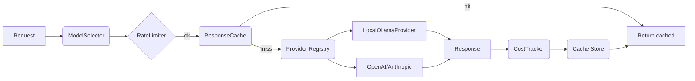
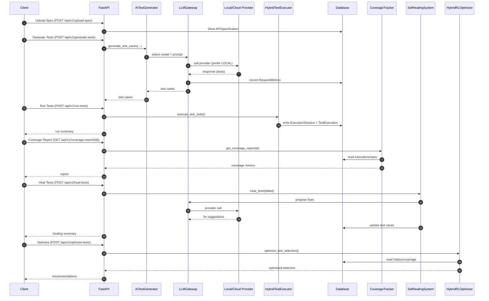

# Architecture and End-to-End Workflow

This document provides system architecture and end‑to‑end workflow diagrams for the AI‑Powered API Testing Framework.

## 1) System Architecture (component view)

```mermaid
graph TD
  UI[Frontend (React)] --> API[FastAPI Service]

  subgraph API Layer
    API --> R1[Specs Router]
    API --> R2[Test Generation Router]
    API --> R3[Test Execution Router]
    API --> R4[Healing Router]
    API --> R5[Coverage/Analytics Router]
    API --> R6[RL Optimization Router]
  end

  subgraph Services
    R2 --> Gen[AITestGenerator]
    R3 --> Exec[HybridTestExecutor]
    R5 --> Cov[CoverageTracker]
    R4 --> Heal[SelfHealingSystem]
    R6 --> RL[HybridRLOptimizer]
  end

  Gen --> LLM[LLMGateway]
  Heal --> LLM
  LLM --> Mon[CostMonitor]

  subgraph Providers
    LLM --> P1[LocalOllamaProvider]
    LLM --> P2[OpenAIProvider (stub)]
    LLM --> P3[AnthropicProvider (stub)]
  end

  Services --> DB[(SQLAlchemy DB: SQLite/Postgres)]
  RAG[(ChromaDB - optional)] -.-> Gen
```

Key flows:
- API routers orchestrate domain services (generation, execution, coverage, healing, RL).
- AITestGenerator and SelfHealingSystem route prompts via LLMGateway, which applies cost control, caching, rate limiting, and provider selection (prefers free LOCAL/Ollama when configured).
- Results are persisted via SQLAlchemy models; analytics and dashboards read aggregated data.

## 2) LLM Gateway internals (simplified)



Highlights:
- ModelSelector chooses a model subject to user constraints and budgets.
- RateLimiter enforces provider throughput; ResponseCache avoids repeat spend.
- Provider Registry abstracts concrete providers; LocalOllamaProvider enables zero‑cost local inference.
- CostTracker + CostMonitor provide budget enforcement and predictive alerts.

## 3) End‑to‑End Workflow (sequence)



## 4) Data model (core entities)
- APISpecification: OpenAPI source, parsed_endpoints, base_url, metadata.
- TestCase: endpoint/method, test data, assertions, expected responses, generated_by_llm.
- ExecutionSession and TestExecution: run-level and per-test results, timings, statuses.
- CoverageReport/Metrics: aggregates for dashboards and gap analysis.
- RLModel: algorithm/version, episodes, performance.
- HealingSuggestion: suggestion type, confidence, priority, application results.

## 5) Operational concerns
- Security: API key auth, secure CORS, rate limiting, security headers, input sanitization.
- Cost: Local provider (Ollama) preferred; budgets/alerts via CostMonitor.
- Performance: Async concurrency, LRU cache, batching (future optimization hooks).
- Observability: Health/status endpoints, structured logging, probe scripts.

---

For hands‑on examples, see:
- docs/usage_examples.md
- scripts/test_local_provider.py (local LLM smoke test)
- scripts/probe_endpoints.py (API probe)

